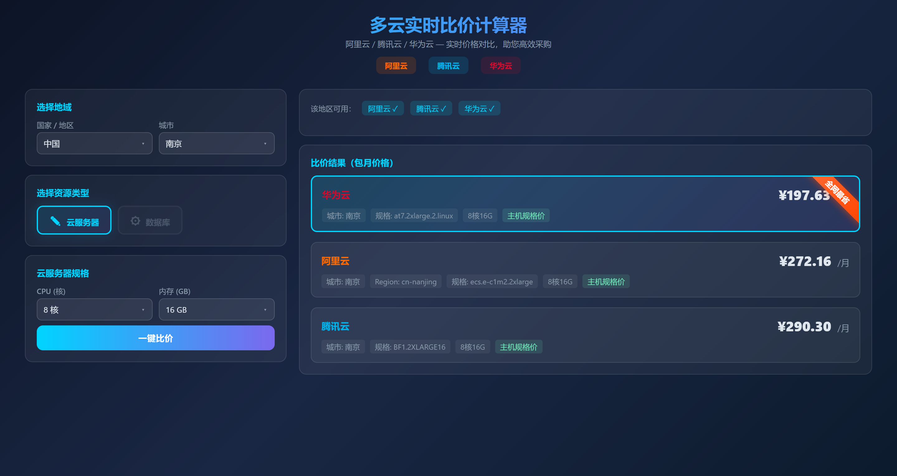

# 多云实时比价计算器

阿里云 / 腾讯云 / 华为云 实时价格对比工具，通过逆向官网免登录接口获取真实定价数据，无任何 Mock 数据。

## 功能特性

- **实时比价** — 直接调用三大云厂商价格计算器 API，返回真实实时价格
- **地域联动** — 国家 → 城市两级联动，支持中国、新加坡、日本、美国、德国等区域
- **资源类型** — 云服务器（已支持）、数据库（即将上线）
- **规格筛选** — CPU、内存均支持"全部"选项和搜索框
- **全城最低** — 选择"全部"城市时，自动遍历所有城市返回每家云的最低价
- **全网最省** — 结果按包月价格排序，最便宜的打上醒目标签

## 技术栈

| 层 | 技术 |
|---|------|
| 前端 | Vue 3 (CDN) + 原生 CSS |
| 后端 | Python FastAPI + Httpx |
| 接口 | 阿里云 buy-api / 腾讯云 workbench / 华为云 portal API |

## 项目结构

```
cloud_price-calc/
├── backend/
│   ├── main.py              # FastAPI 入口，提供 /api/countries、/api/specs、/api/compare
│   ├── config.py             # 国家-城市-厂商映射、实例规格映射表
│   ├── aliyun_provider.py    # 阿里云价格代理
│   ├── tencent_provider.py   # 腾讯云价格代理
│   ├── huawei_provider.py    # 华为云价格代理
│   └── requirements.txt
└── frontend/
    └── index.html            # 单文件前端，含搜索下拉、资源类型切换、结果展示
```

## 快速开始

```bash
# 1. 安装依赖
cd backend
pip install -r requirements.txt

# 2. 启动服务
python -m uvicorn main:app --host 0.0.0.0 --port 8000

# 3. 打开浏览器
# 访问 http://localhost:8000
```

## API 接口

| 方法 | 路径 | 说明 |
|------|------|------|
| GET | `/api/countries` | 获取国家与城市列表 |
| GET | `/api/specs` | 获取可选规格（CPU、内存） |
| POST | `/api/compare?country=&city=&cpu=&mem=` | 查询三家云主机规格价格，按价格升序返回 |

`city` 传 `全部` 时遍历该国家所有城市，返回每家最低价。`cpu`/`mem` 传 `0` 时使用默认值 2核4G。

## 接口逆向说明

本项目通过浏览器 DevTools Network 面板逆向三大云厂商价格计算器的免登录接口：

- **阿里云** — `POST buy-api.aliyun.com/price/getLightWeightPrice2.json`，需 CSRF Token
- **腾讯云** — `POST workbench.cloud.tencent.com/cgi/api?i=cvm/DescribeZoneInstanceConfigInfos`，免登录，价格直接在实例列表响应中
- **华为云** — `GET portal.huaweicloud.com/api/calculator/rest/cbc/portalcalculatornodeservice/v4/api/productInfo`，免登录，月费在 planList 中

未接入任何 AK/SK，不存储用户数据。

## 截图



## License

MIT
